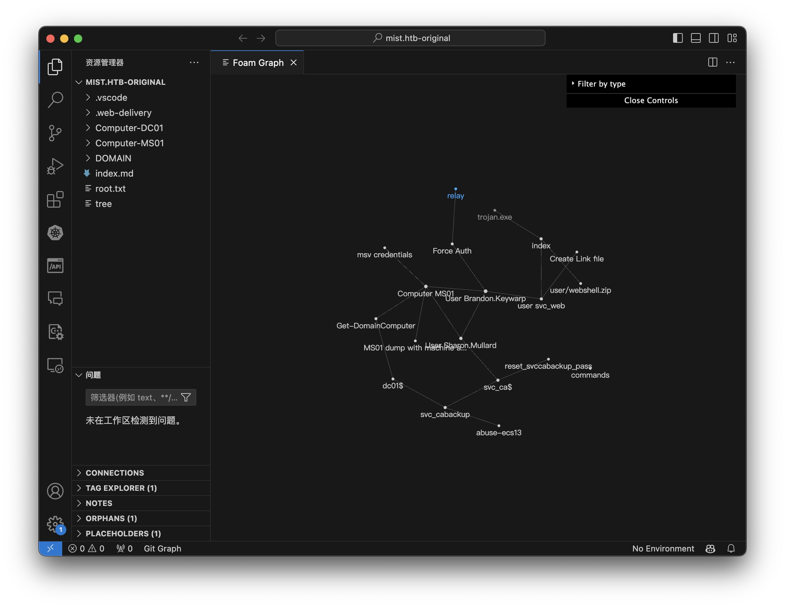
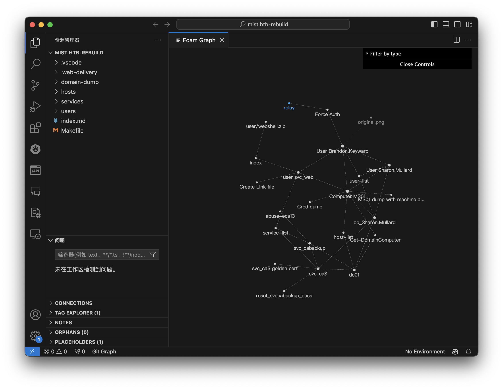

# Here is the Sample of Weaponized VSCode 

## [Original one is when i was solving that machine.](./mist.htb-original/)

Generate Walkthrough graph: 

## [Rebuild one is using New Weaponzied VSCode to rebuild. ](./mist.htb-rebuild/)

Generate Walkthrough graph: 